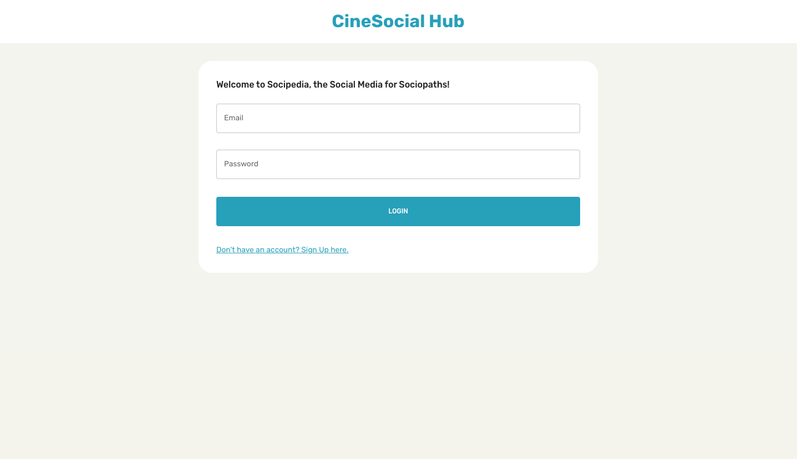
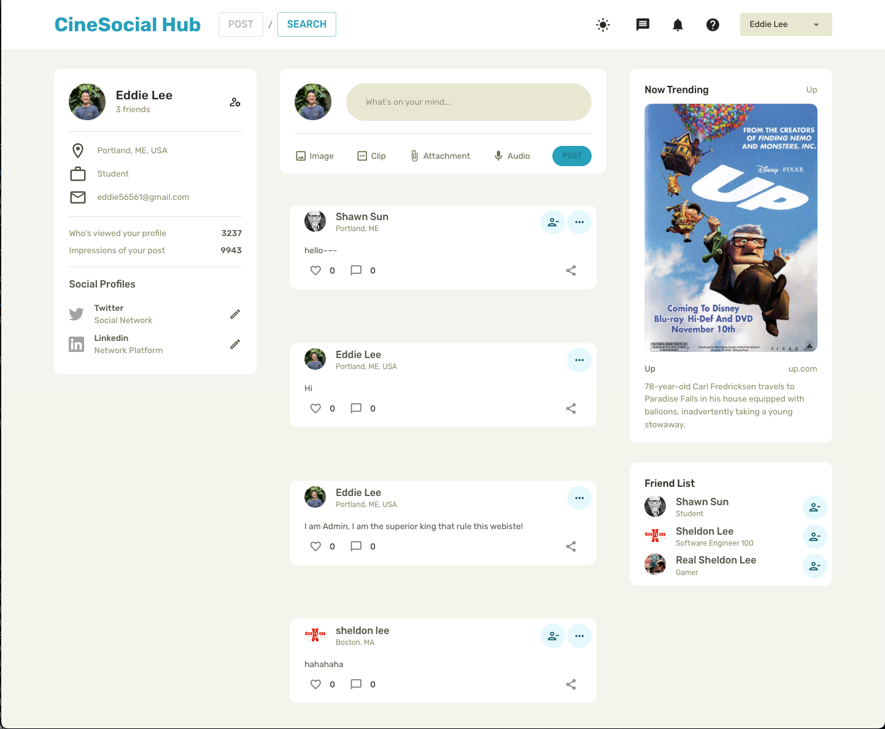
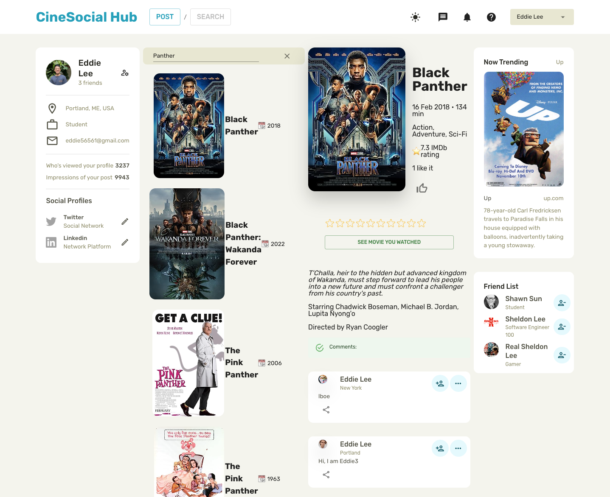

# CineSocial Hub

Web Link: https://movie-social-hub.netlify.app

Backend Repositories: https://github.com/tom56561/movie-server

The frontend is hosted on Netlify, and the backend is hosted on Render.

# Features

Our platform offers a rich set of features designed to enhance the user experience, incorporating the latest trends in web development and UI/UX design:

- **Login and Register**: Secure authentication system allowing users to create and access their accounts.
- **User Profile**: Personalized user profiles where members can view and edit their information.
- **Friends and Follow Feature**: Connect with friends and follow their profiles to stay updated on their activities.
- **Movie Search**: Integration with a third-party API to search for movies, providing users with a vast library of films to explore.
- **Comments**: Users can leave comments on each movie, fostering a community of movie enthusiasts.
- **Posts Feature**: Members can create posts, sharing their thoughts, reviews, or movie recommendations with the community.
- **UI/UX Design**: A modern and user-friendly interface that adheres to the latest UI/UX design trends, ensuring an enjoyable experience for all users.
- **Dark and Light Mode**: A dynamic design layout that allows users to switch between dark and light modes, catering to personal preferences and reducing eye strain.

# Preview
### Login Page

### Search Page

### Post Page

### Profile Page

### Dark Mode Page
Click the button in the red circle to switch Light/Dark Mode

# UI Style Guide

This document outlines the color design tokens and theme settings for the website's user interface, aligned with 2023 UI trends.

## Color Design Tokens

Our design system uses a set of predefined color tokens to maintain consistency and adhere to the latest design trends.

### Grey Scale

Nature-inspired neutral tones with a personalization twist:

- `--color-grey-0`: #FFFFFF (Pure white)
- `--color-grey-10`: #F4F4ED (Natural linen off-white)
- `--color-grey-50`: #E8E8D0 (Sand beige)
- `--color-grey-100`: #D1D1B2 (Herbal warm grey)
- `--color-grey-200`: #B3B38C (Muted olive)
- `--color-grey-300`: #8E8E66 (Sage green)
- `--color-grey-400`: #6A6A4A (Wet bark brown-grey)
- `--color-grey-500`: #555546 (Forest floor dark tone)
- `--color-grey-600`: #3F3F32 (Deep moss green)
- `--color-grey-700`: #292921 (Rich soil brown)
- `--color-grey-800`: #141412 (Deep woods at night)
- `--color-grey-900`: #0A0A06 (Darkest shade before black)
- `--color-grey-1000`: #000000 (Pure black)

### Primary Colors

Bold and bright colors for dark mode and accentuation:

- `--color-primary-50`: #E3F9FD (Light sky blue)
- `--color-primary-100`: #C2EFFB (Clear day blue)
- `--color-primary-200`: #80DFF7 (Vibrant cyan)
- `--color-primary-300`: #3ED0F3 (Bright blue with green hint)
- `--color-primary-400`: #00C0EF (Electric blue)
- `--color-primary-500`: #00A0BC (Pantone-inspired classic blue)
- `--color-primary-600`: #007D99 (Deep ocean blue)
- `--color-primary-700`: #005766 (Dark teal)
- `--color-primary-800`: #003440 (Sea depths blue)
- `--color-primary-900`: #001B22 (Darkest of blue before black)

## Theme Settings

Our theme settings function dynamically applies these tokens based on the chosen mode (light or dark). It ensures that our UI is consistent, accessible, and incorporates the latest trends for a pleasing aesthetic and user experience.

### Light Mode

Utilizes lighter shades for a bright and airy interface.

### Dark Mode

Employs darker shades for a modern look that reduces eye strain.

Remember to reference these tokens in your CSS to maintain consistency across components and layouts.

